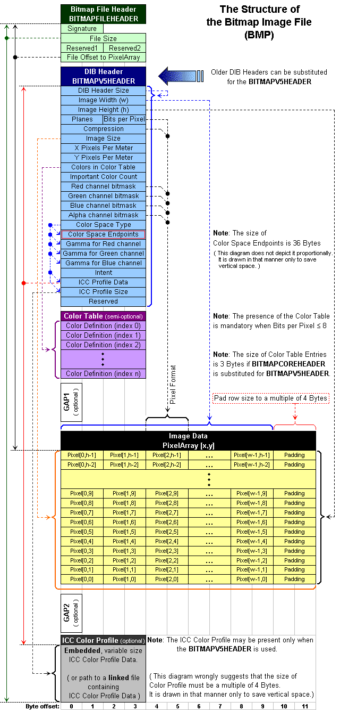
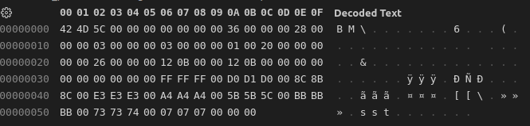

# BMP Image File Format Comprehension
<!-- more -->

cite https://docs.fileformat.com/image/bmp/
- [BMP Image File Format Comprehension](#bmp-image-file-format-comprehension)
  - [BMP File Format Specifications](#bmp-file-format-specifications)
    - [File Header](#file-header)
    - [DIB header (bitmap information header)](#dib-header-bitmap-information-header)
      - [OS/2 1.x BITMAP](#os2-1x-bitmap)
      - [Windows Bitmap](#windows-bitmap)
    - [Color Palette](#color-palette)
    - [Pixel Storage](#pixel-storage)
  - [Example Explanation](#example-explanation)
## BMP File Format Specifications

|Structure   |Optional   |Size    |Purpose   |
|---|---|---|---|
| File Header  | No  |  14 | To store general information about the bitmap image file  |
|DIB Header|	No|	Fixed-Size|	To store detailed information about the bitmap image and define the pixel format|
|Extra Bit Masks|	Yes	|12 or 16 bytes	|To define the pixel format|
|Colour Palette	|Semi-optional	|Variable-size|	To define colours used by the bitmap image data|
|Gap1	|Yes|	Variable-size|	Structure alignment|
|Pixel Array	|No|	Variable-size|	Pixel format is defined by the DIB header or Extra bit masks.|
|Gap2	|Yes|	Variable-size|	Structure alignment|
|ICC Color profile	|Yes|	Variable-size|	To define the colour profile for colour management|

			
### File Header
| Offset hex  | Offset dec  | Size | Purpose|
|---|---|---|---|
| 00  | 0  | 2 bytes|The header field used to identify the BMP and DIB file is 0x42 0x4D in hexadecimal, same as BM in ASCII. It can following possible values.* BM – Windows 3.1x, 95, NT, … etc. * BA – OS/2 struct bitmap array * CI – OS/2 struct color icon * CP – OS/2 const color pointer * IC – OS/2 struct icon * PT – OS/2 pointer|
|02	|2	|4 bytes|	The size of the BMP file in bytes|
|06	|6	|2 bytes|	Reserved; actual value depends on the application that creates the image|
|08	|8	|2 bytes|	Reserved; actual value depends on the application that creates the image|
|0A	|10	|4 bytes|	The offset, i.e. starting address, of the byte where the bitmap image data (pixel array) can be found.|

### DIB header (bitmap information header) 
The detailed information about the image is represented by this header. Based on this information, application will be determined that will be used to display the image on the screen. All such headers contain a DWORD (32-bit) field, specifying their size, so that an application can easily determine the header used int he image. This is basically due to the fact that the DIB format underwent several extensions. Following is the DIB Header with listed fields.

There're different kinds of headers, but they'are different and can be distinguash with each other

#### OS/2 1.x BITMAP
|Offset hex| Offset dec| Size bytes| OS/2 1.x BITMAP COREHEADER|
|---|---|---|---|
|0E|14|4|The size of this header(12 bytes)|
|12|18|2|The bitmap width in pixels(unsigned 16-bit)|
|14|20|2|The bitmap height in pixels(unsigned 16-bit)|
|16|22|2|The number of color planes, must be 1|
|18|24|2|The number of bits per pixel(16 or 32 bpp)|

#### Windows Bitmap
|Offset hex| Offset dec| Size bytes| Windows Bitmap INFOHEADER|
|---|---|---|---|
|0E|14|4|The size of this header(40 bytes)|
|12|18|4|The bitmap width in pixels(signed integer)|
|16|22|4|The bitmap height in pixels(signed integer)|
|1A|26|2|The number of color planes, must be 1|
|1C|28|2|The number of bits per pixel(1,4,8,16,24 and 32)|
|1E	|30	|4|	the compression method being used. See the next table for a list of possible values|
|22	|34	|4|	the image size. This is the size of the raw bitmap data; a dummy 0 can be given for BI_RGB bitmaps.|
|26	|38	|4|	the horizontal resolution of the image. (pixel per metre, signed integer)|
|2A	|42	|4|	the vertical resolution of the image. (pixel per metre, signed integer)|
|2E	|46	|4|	the number of colors in the color palette, or 0 to default to 2n|
|32	|50	|4|	the number of important colors used, or 0 when every color is important; generally ignored|

### Color Palette 
A BMP color palette is an array of structures that specify the RGB intensity values of each colour in a display device’s colour palette. Each pixel in the bitmap data stores a single value used as an index into the colour palette. The colour information stored in the element at that index specifies the colour of that pixel. Availability of colour in a bitmap file varies as follow:

* One, 4 and 8-bit - expected to always contain a colour palette
* Sixteen, 24 and 32-bit - never contain colour palettes
* Sixteen and 32-bit BMP files - contain bitfields mask values in place of the colour palette

### Pixel Storage 
Bitmap pixels are stored as bits packed in rows where  the size of each row is rounded up to a multiple of 4 bytes (a 32-bit DWORD) by padding. The total amount of bytes required to store the pixels of an image can not be directly calculated by just counting the bits. Since there is padding involved, the effect of round up the size of each row to a multiple of 4 bytes is required. Padding bytes (not necessarily 0) are to be appended to the end of the rows in order to bring up the length of the rows to a multiple of four bytes. When the pixel array is loaded into memory, each row must begin at a memory address that is a multiple of 4.

The image is actually described by the 32-bit DWORDs representation of the pixel array. Usually pixels are stored “bottom-up”, starting in the lower left corner, going from left to right, and then row by row from the bottom to the top of the image. Pixel formats and their implications are as listed below:

The 1-bit per pixel (1bpp) format supports 2 distinct colours, (for example: black and white).
The 2-bit per pixel (2bpp) format supports 4 distinct colours and stores 4 pixels per 1 byte, the left-most pixel being in the two most significant bits. Each pixel value is a 2-bit index into a table of up to 4 colours.
The 4-bit per pixel (4bpp) format supports 16 distinct colours and stores 2 pixels per 1 byte, the left-most pixel being in the more significant nibble. Each pixel value is a 4-bit index into a table of up to 16 colours.
The 8-bit per pixel (8bpp) format supports 256 distinct colours and stores 1 pixel per 1 byte. Each byte is an index into a table of up to 256 colours.
The 16-bit per pixel (16bpp) format supports 65536 distinct colours and stores 1 pixel per 2-byte WORD. Each WORD can define the alpha, red, green and blue samples of the pixel.
The 24-bit pixel (24bpp) format supports 16,777,216 distinct colours and stores 1 pixel value per 3 bytes. Each pixel value defines the red, green and blue samples of the pixel (8.8.8.0.0 in RGBAX notation). Specifically, in the order: blue, green and red (8 bits per each sample).
The 32-bit per pixel (32bpp) format supports 4,294,967,296 distinct colours and stores 1 pixel per 4-byte DWORD. Each DWORD can define the alpha, red, green and blue samples of the pixel.

## Example Explanation

There is a 3 x 3 pixels bmp format file.

we open it as a hex format:

For file header, first 2 bytes are 0x42 4D  or 'BM' in ASCII which means this is a BMP and DIB file. 

The next 4 bytes are 0x5C 00 00 00 represent the size of this file(in bytes), because this is a little-endian system, so the real num of bytes is 0x5C. As we can seee from the pic, the index of the bytes is from 0x00 to 0x5B whose length is totally 0x5C.

The next 4 bytes are reserved.

The next 4 bytes is the offset of the start address, here it is 0x36.

The next 4 bytes are 0x 28 00 00 00 which means this is a 40 bytes long windows bitmap. the width of this image is 3, the height of this image is 3. color depth is 0x20 bpp which is 32bpp. The image size is 0x26 which is 38(from 0x36 to 0x5B, 4 * 9 = 36 + 2 more 0x00 bytes(not know the meaning...))

One thing should be attention:
**Pixel Array is from left to right and from bottom to top of the image**